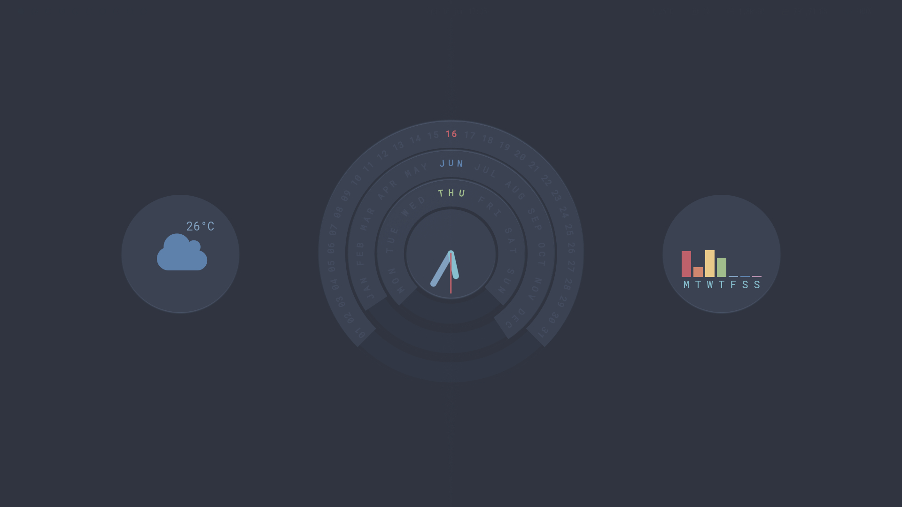

# Startpages 
Algumas startpages que eu fiz usando html, css e js

> Nord clock

it's is not originally my i just do an manifest.json to use as startpage chrome/firefox extension
if you want to verify the original, it's here https://github.com/Micro-Nordic/Nordic-Circular-Calendar-Clock-Display

> Terminal Start Page

.jpg)
It is an terminal based startpage, it provides date, day and links that you can easily change in the html

> Minimal Start Page(NOT FINISHED)

.jpg)
This is here in case you want to finish, my idea was to make a flexible startpage, with the possibility of switching between search engines